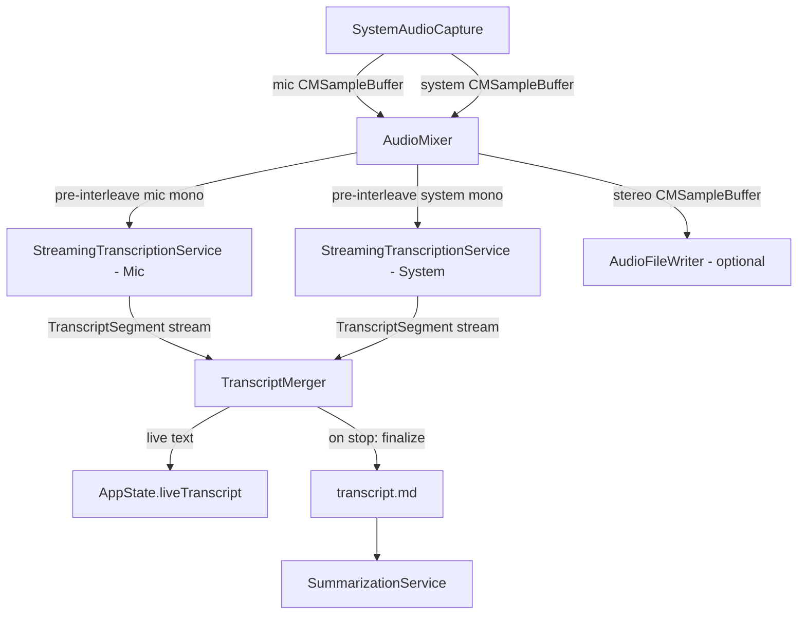

# Replace whisper.cpp with Native Streaming Transcription (SpeechAnalyzer)

## Overview

Replace the current batch whisper.cpp transcription pipeline with Apple's new `SpeechAnalyzer` / `SpeechTranscriber` APIs (macOS 26 Tahoe). This enables **real-time streaming transcription during recording** — the transcript builds live instead of requiring a multi-minute post-processing step. Audio file saving becomes configurable (on by default, can be disabled). The minimum deployment target moves to macOS 26.

## Problem Statement / Motivation

The current pipeline is strictly sequential:

```
Record (minutes) → Stop → Convert m4a→WAV (seconds) → 2x whisper.cpp (minutes) → Summarize (30-60s)
```

**Pain points:**
1. **Multi-minute wait after recording stops** — a 1hr meeting can take 5-10 min to process
2. **External dependency on whisper.cpp** — users must install it, find models, keep paths correct
3. **Complex format conversion chain** — m4a → stereo WAV → 2x mono WAV just to feed whisper
4. **~500 lines of parsing code** for VTT/JSON/WTS output formats and re-segmentation
5. **No live feedback** — user has no idea what's being captured until processing finishes
6. **Can't start new recording during processing** — state machine blocks on transcription phase

**What the new API offers:**
- **70x real-time speed** (Argmax benchmark on M4), fully on-device
- **Word-level timestamps** via `audioTimeRange` on `AttributedString` runs
- **AsyncStream-native** — designed for streaming audio buffers directly
- **No external binaries or model files** — models managed by OS via `AssetInventory`
- **Volatile + final results** — show "live guesses" during recording, finalized text after

## Proposed Solution

### High-Level Architecture (After)

```
AudioCaptureCoordinator
  ├─ SystemAudioCapture (unchanged — Core Audio Taps + AVAudioEngine mic)
  ├─ AudioMixer (unchanged — stereo mixing, levels, limiter)
  │   └─ NEW: Pre-interleave mono taps for mic & system channels
  ├─ AudioFileWriter (now optional, gated by setting)
  └─ NEW: StreamingTranscriptionService
        ├─ SpeechAnalyzer + SpeechTranscriber (mic channel)
        ├─ SpeechAnalyzer + SpeechTranscriber (system channel)
        ├─ Writes transcript.md progressively
        └─ Delivers live text to AppState for UI display
```

**Key change:** Transcription happens *during* recording, not after. When the user stops recording, the transcript is already 95%+ complete — only a brief finalization pass is needed.

### Diarization Strategy

Run **two independent `SpeechTranscriber` instances** — one for mic audio (speaker = "Me"), one for system audio (speaker = "Them"). The `AudioMixer` already maintains separate per-source ring buffers (`micBuffer`, `systemBuffer`) at 48kHz mono float32 before interleaving to stereo. We tap those buffers pre-interleave and route to separate analyzers.

Merge strategy is identical to today: sort all segments by timestamp, format with speaker labels.

## Technical Approach

### Architecture



### Implementation Phases

#### Phase 1: StreamingTranscriptionService (core engine)

New file: `Munin/Munin/Processing/StreamingTranscriptionService.swift`

**Responsibilities:**
- Manages one `SpeechAnalyzer` + `SpeechTranscriber` pair for a single audio channel
- Accepts `AVAudioPCMBuffer` or `[Float]` samples via an async method
- Converts to `AnalyzerInput` format using `SpeechAnalyzer.bestAvailableAudioFormat(compatibleWith:)`
- Streams results (volatile + final) via an `AsyncStream<TranscriptSegment>`
- Handles model download on first use via `AssetInventory`

**Key code pattern:**
```swift
let transcriber = SpeechTranscriber(
    locale: Locale.current,
    transcriptionOptions: [],
    reportingOptions: [.volatileResults],
    attributeOptions: [.audioTimeRange]
)

let analyzer = SpeechAnalyzer(modules: [transcriber])
let format = await SpeechAnalyzer.bestAvailableAudioFormat(compatibleWith: [transcriber])
let (inputSequence, inputBuilder) = AsyncStream<AnalyzerInput>.makeStream()

try await analyzer.start(inputSequence: inputSequence)

// Feed audio:
let converted = try converter.convertBuffer(buffer, to: format)
inputBuilder.yield(AnalyzerInput(buffer: converted))

// Consume results:
for try await result in transcriber.results {
    let text = String(result.text.characters)
    // Extract word-level timestamps from AttributedString runs
    for run in result.text.runs {
        if let timeRange = run.audioTimeRange {
            // CMTimeRange with start + duration
        }
    }
}
```

**Tasks:**
- [x] Create `StreamingTranscriptionService` class
- [x] Implement `AnalyzerInput` conversion from 48kHz mono float32 → analyzer format
- [x] Implement result stream with `TranscriptSegment` output (reuse existing struct, add `isFinal` field)
- [x] Add model availability check + download with progress reporting
- [x] Handle `finalizeAndFinishThroughEndOfInput()` on stop with 30s timeout
- [x] Handle errors gracefully (model not available, locale not supported, analyzer failure)
- [x] Progressive file writing: flush final segments to transcript.md every ~10s (atomic write)
- [x] Add Speech Recognition permission request to `PermissionChecker` (request at app launch alongside mic)

#### Phase 2: AudioMixer pre-interleave taps

Modify: `Munin/Munin/Audio/AudioMixer.swift`

Add a callback that fires with per-channel mono samples **before** they are interleaved to stereo. This is the natural integration point — the samples are already resampled to 48kHz mono float32.

**Change in `processBuffers()`:**
```swift
// After extracting micSamples and systemSamples, before interleaving:
preInterleaveTapHandler?(micSamples, systemSamples)
```

**Tasks:**
- [x] Add `preInterleaveTapHandler: (([Float], [Float]) -> Void)?` to `AudioMixer`
- [x] Call it in `processBuffers()` before soft limiting + interleaving
- [x] Also call it in `flush()` for remaining samples

#### Phase 3: AudioCaptureCoordinator wiring

Modify: `Munin/Munin/Audio/AudioCaptureCoordinator.swift`

The coordinator becomes the fan-out point. It creates two `StreamingTranscriptionService` instances (mic + system) and wires the mixer's pre-interleave tap to feed them.

**Tasks:**
- [x] Create two `StreamingTranscriptionService` instances
- [x] Wire `audioMixer.preInterleaveTapHandler` to feed samples to both services
- [x] Expose merged transcript stream (or individual streams) upward to `AppState`
- [x] On `stopCapture()`, finalize both analyzers and collect final transcripts
- [ ] Make `AudioFileWriter` optional (gated by a passed-in setting) *(deferred to Phase 5)*

#### Phase 4: AppState & UI integration

Modify: `Munin/Munin/App/AppState.swift`, recording indicator views

**New published state:**
```swift
@Published private(set) var liveTranscript: String = ""
@Published private(set) var isTranscribing: Bool = false
```

**State machine changes:**
- During `.recording`, transcript builds live via `liveTranscript`
- On stop: brief `.processing(.finalizing)` phase (seconds, not minutes) while analyzers finalize volatile results
- `.processing(.transcribing)` phase eliminated or becomes near-instant
- `.processing(.summarizing)` remains unchanged

**UI changes:**
- Recording indicator can optionally show a "transcribing..." dot or live word count
- Main app window shows live transcript during recording (scrolling text view)
- Post-recording, transcript is already written — just needs summarization

**Tasks:**
- [ ] Add `liveTranscript` published property *(deferred to follow-up PR)*
- [x] Rewire `stopRecording()` — finalize transcription (fast), skip old `TranscriptionService`, go straight to summarization
- [x] Add `.processing(.finalizing)` phase or repurpose `.processing(.transcribing)` as a brief finalization
- [ ] Update UI to show live transcript during recording *(deferred to follow-up PR)*
- [x] Show "Finalizing transcription..." instead of "Transcribing..." after stop

#### Phase 5: Configurable audio file saving

New file: `Munin/Munin/App/Settings.swift` (or add to existing settings)

**Setting:** `saveAudioFiles: Bool` (default `true`)

When disabled:
- `AudioFileWriter` is not created
- `MeetingRecord.audioURL` file won't exist
- Folder structure remains the same (transcript.md + summary.md still written)
- Saves ~1-2MB/min of disk space

When enabled:
- Current behavior — stereo m4a saved alongside transcript

**Tasks:**
- [ ] Add UserDefaults-backed setting for `saveAudioFiles`
- [ ] Pass setting through to `AudioCaptureCoordinator`
- [ ] Add toggle in settings UI
- [ ] Update `MeetingStorage.listMeetings()` to not require `audio.m4a` existence

#### Phase 6: Cleanup & removal of whisper.cpp code

**Delete or gut:**
- `TranscriptionService.swift` — the entire whisper.cpp pipeline (586 lines). Can be replaced by a thin wrapper that invokes the new service, or deleted entirely.
- Remove whisper binary search logic, afconvert calls, VTT/JSON/WTS parsing, word re-segmentation logic
- `ProcessRunner.swift` — keep for `SummarizationService`, but remove transcription-specific timeout handling
- Remove whisper model path references from CLAUDE.md and README

**Keep:**
- `TranscriptSegment` struct concept (adapt for new API)
- `mergeTranscripts()` logic (still needed for dual-channel merge)
- `formatDiarizedTranscript()` logic (still needed for markdown output)
- `formatTimestamp()` utility

**Tasks:**
- [x] Remove whisper.cpp integration code
- [x] Remove afconvert conversion pipeline
- [x] Remove VTT/JSON/WTS parsing
- [x] Update CLAUDE.md to reflect new architecture
- [ ] Update README requirements (remove whisper.cpp, add macOS 26 requirement) *(no README exists yet)*

## Alternative Approaches Considered

### 1. Keep whisper.cpp as fallback
**Rejected.** User chose macOS 26 only. Maintaining two transcription backends adds complexity for no benefit. The Argmax benchmarks show SpeechAnalyzer is competitive with whisper-base (14.0 vs 15.2 WER) while being dramatically simpler to integrate.

### 2. Single SpeechAnalyzer for mixed audio
**Rejected.** Running one analyzer on stereo-mixed audio would lose diarization. The dual-analyzer approach (one per channel) preserves the existing "Me" vs "Them" speaker labeling, which is a key feature for meeting transcripts.

### 3. Use DictationTranscriber instead of SpeechTranscriber
**Not appropriate.** `DictationTranscriber` adds punctuation and formatting (good for dictation), but `SpeechTranscriber` is designed for "normal conversation and general purposes" — better fit for meeting transcription. Can revisit if users want more punctuation.

### 4. Stream to a single analyzer, use SpeechDetector for VAD-based diarization
**Rejected.** `SpeechDetector` only detects speech presence, not speaker identity. The dual-channel approach (mic = me, system = them) is more reliable for meeting diarization than any audio-only speaker clustering.

## Edge Cases & Error Handling

### Model Download on First Use
- **Behavior:** Start audio capture immediately; transcription is disabled until model downloads. Show progress in main app window status area (non-blocking).
- If download fails (network, disk full): recording continues audio-only, notification shows "Transcription unavailable — model download failed"
- On subsequent recordings, retry download automatically
- Consider pre-downloading model at app launch (in `AppDelegate.applicationDidFinishLaunching`) if not yet installed

### Speech Recognition Permission Denied
- Recording continues in audio-only mode (no transcription, no summarization)
- Notification: "Speech Recognition permission required for live transcription"
- Audio file always saved when transcription unavailable (override setting)
- User can grant permission later in System Settings; next recording will transcribe

### Partial Analyzer Failure (One Channel Fails)
- Continue recording with the working channel only
- Failed channel produces no segments (not blank placeholders)
- Show subtle warning in recording indicator: "System audio transcription unavailable"
- Transcript will only contain one speaker's segments — still useful

### App Crash During Recording
- Progressive transcript writes every ~10 seconds (final results only, atomic write via temp file + rename)
- Audio file is recoverable (AVAssetWriter flushes periodically by design)
- On restart: detect orphan meeting folders (has audio.m4a or partial transcript.md but no summary.md and recording was <5 min ago) — show "Recover last recording?" prompt
- Recovery: run summarization on whatever transcript exists

### Volatile vs Final Result Strategy
- **In-memory only:** Volatile results shown in UI with 0.5 opacity, never written to disk
- **On disk:** Only final results written to transcript.md
- When final result arrives, it replaces all volatile results for that time range (full replacement, not merge)
- `liveTranscript` string = finalized text + current volatile text (volatile appended at end)

### Short Recordings (< 3 seconds)
- If no final results received, wait up to 10s during finalization
- If still nothing, write transcript.md with header only (no segments)
- Summarization skipped on empty transcripts

### Silence-Only Recordings
- SpeechAnalyzer produces no results (no error, just empty stream)
- transcript.md written with header + `*[No speech detected]*`
- Summarization skipped

### Finalization Timeout
- After `finalizeAndFinishThroughEndOfInput()`, wait max 30 seconds
- If timeout: use whatever final segments exist, discard remaining volatile
- Show "Transcription finalized (some segments may be approximate)" if timeout hit

### `liveTranscript` Memory Management
- Write final segments to disk immediately; `liveTranscript` holds last ~50 segments for UI display (sliding window)
- On stop, `liveTranscript` cleared; full transcript read from file if needed for display
- Long recordings (2hr+): memory stays bounded

### Audio File Setting
- Setting locked during active recording (toggle greyed out)
- Only applies to next recording
- `MeetingStorage.listMeetings()` updated to check for transcript.md OR audio.m4a

### Pre-Interleave Tap Backpressure
- Tap handler dispatches samples to a bounded async buffer (queue capacity ~2 seconds of audio)
- If buffer full, oldest samples dropped (transcription gap, not audio quality loss)
- Audio file writing and mixing unaffected — tap is a passive observer

## Acceptance Criteria

### Functional Requirements
- [ ] Transcript appears live during recording (volatile results shown with reduced opacity)
- [ ] Final transcript available within seconds of pressing "Stop" (not minutes)
- [ ] Speaker diarization works: "Me" (mic) vs "Them" (system audio) labels preserved
- [ ] Word-level timestamps present in transcript.md (format: `[HH:MM:SS.mmm]`)
- [ ] Transcript format identical or improved vs current whisper.cpp output
- [ ] Audio file saving can be toggled in settings (default: on)
- [ ] Summarization still runs on the finalized transcript (unchanged behavior)
- [ ] Model downloads automatically on first use with progress indication
- [ ] App compiles and runs only on macOS 26+

### Non-Functional Requirements
- [ ] No external binary dependencies for transcription (whisper.cpp, afconvert not needed)
- [ ] Transcription happens on-device (no network required after model download)
- [ ] Memory usage should not spike significantly (SpeechAnalyzer runs outside app memory)
- [ ] Audio capture quality unchanged (same Core Audio Taps + AVAudioEngine pipeline)

### Quality Gates
- [ ] Live transcript matches final transcript (no lost segments)
- [ ] 30+ minute recording transcribes without failure or truncation
- [ ] Clean build with no warnings
- [ ] Existing meeting folder structure preserved (`~/Meetings/DATE/TIME-name/`)

## Success Metrics

- **Post-recording wait time:** From 2-10 minutes → under 10 seconds
- **External dependencies removed:** whisper.cpp binary, whisper model files, afconvert usage
- **Code reduction:** ~500 lines of parsing/conversion code removed
- **User experience:** Live transcript visible during recording

## Dependencies & Prerequisites

- macOS 26 (Tahoe) installed on dev machine (confirmed)
- Xcode 26 (required for SpeechAnalyzer APIs)
- English language model download (~auto on first use via AssetInventory)
- Speech Recognition permission (new permission prompt, in addition to existing Microphone permission)

## Risk Analysis & Mitigation

| Risk | Impact | Mitigation |
|------|--------|------------|
| SpeechAnalyzer accuracy lower than whisper.cpp for meetings | Medium | Argmax benchmarks show comparable WER (14.0 vs 15.2). Test with real meetings. Can tune with `transcriptionOptions`. |
| No custom vocabulary support | Low | SpeechAnalyzer lacks custom vocab (unlike old SFSpeechRecognizer). Acceptable for general meeting use. |
| System audio transcription quality | Medium | The "Them" channel has room echo, compression artifacts. Test separately. If poor, consider feeding mixed audio to a single analyzer with SpeechDetector for segmentation. |
| Model download required on first launch | Low | Show download progress in UI. Models are cached system-wide, persist across app updates. |
| Dual analyzer memory/CPU impact | Medium | SpeechAnalyzer runs outside app memory (per Apple). Test with both analyzers running simultaneously on a real meeting. |
| Only 10 languages supported (vs whisper's 100) | Low | English is the primary use case. 38 locales supported total. Check `SpeechTranscriber.supportedLocales` at runtime. |

## Future Considerations

- **Live transcript in recording indicator window** — show scrolling text in the floating panel
- **Searchable transcript during recording** — since text is available live, could search/highlight
- **Speaker names from calendar** — map "Me"/"Them" to actual participant names using calendar data
- **Multi-language meetings** — could run analyzers with different locales for each channel
- **FluidAudio speaker diarization** — for multi-speaker system audio (more than one remote participant), could integrate third-party speaker clustering on the system audio channel

## Documentation Plan

- [x] Update CLAUDE.md architecture diagram and module table
- [ ] Update README requirements (remove whisper.cpp, add macOS 26) *(no README exists yet)*
- [x] Add `SpeechRecognition` permission to the permissions list in CLAUDE.md

## References & Research

### Internal References
- Audio pipeline: `Munin/Munin/Audio/AudioMixer.swift` (pre-interleave tap point in `processBuffers()`)
- Current transcription: `Munin/Munin/Processing/TranscriptionService.swift` (to be replaced)
- State machine: `Munin/Munin/App/AppState.swift` (state changes needed)
- Coordinator: `Munin/Munin/Audio/AudioCaptureCoordinator.swift` (fan-out point)

### External References
- [WWDC25 Session 277: Bring advanced speech-to-text to your app with SpeechAnalyzer](https://developer.apple.com/videos/play/wwdc2025/277/)
- [Apple SpeechAnalyzer Documentation](https://developer.apple.com/documentation/speech/speechanalyzer)
- [Apple SpeechTranscriber Documentation](https://developer.apple.com/documentation/speech/speechtranscriber)
- [Bringing advanced speech-to-text capabilities to your app (Apple sample code)](https://developer.apple.com/documentation/Speech/bringing-advanced-speech-to-text-capabilities-to-your-app)
- [Argmax: Apple SpeechAnalyzer vs WhisperKit benchmarks](https://www.argmaxinc.com/blog/apple-and-argmax) — WER and speed comparisons
- [swift-scribe: Reference implementation with SpeechAnalyzer + speaker diarization](https://github.com/FluidInference/swift-scribe)
- [Stenographer: macOS Tahoe file transcription app](https://github.com/otaviocc/Stenographer)
- [CreateWithSwift: Implementing SpeechAnalyzer in SwiftUI](https://www.createwithswift.com/implementing-advanced-speech-to-text-in-your-swiftui-app/)
